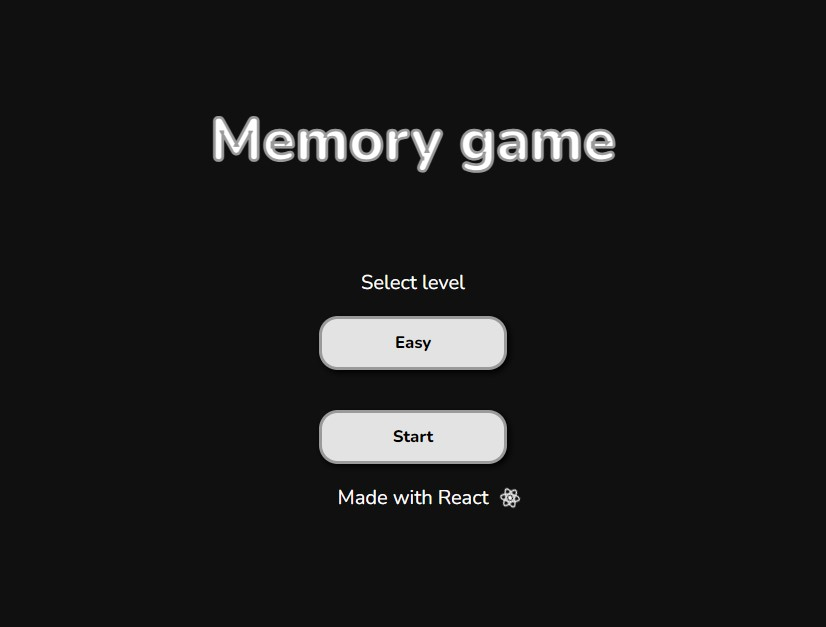
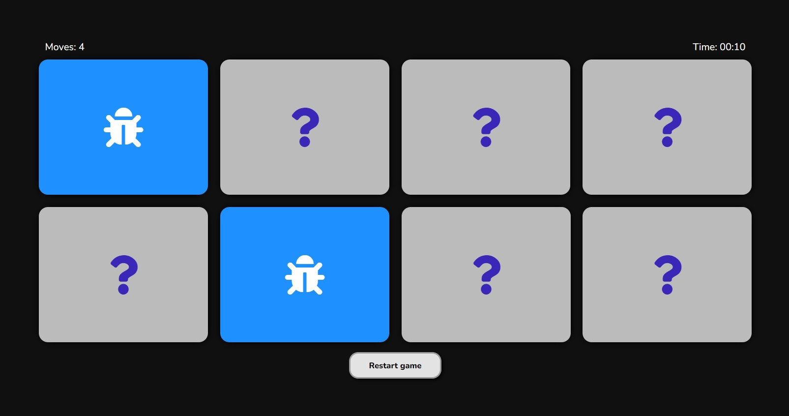
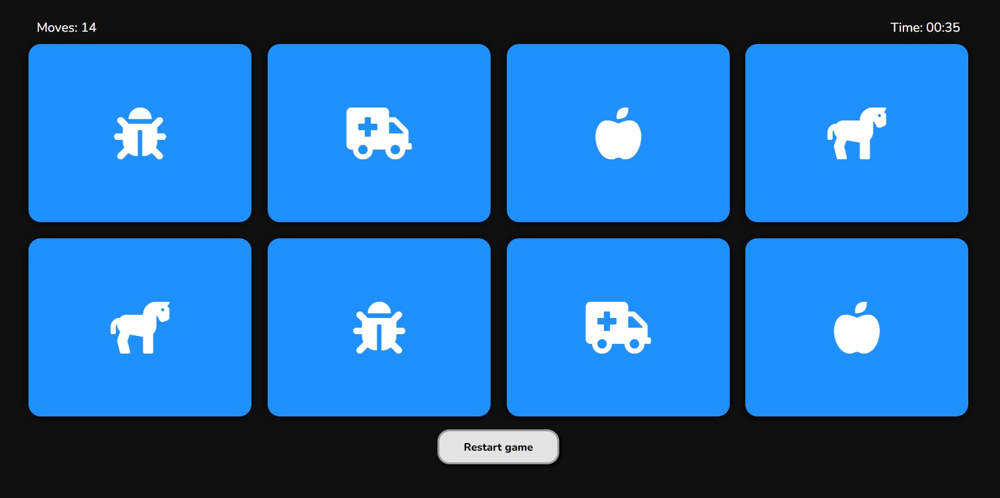
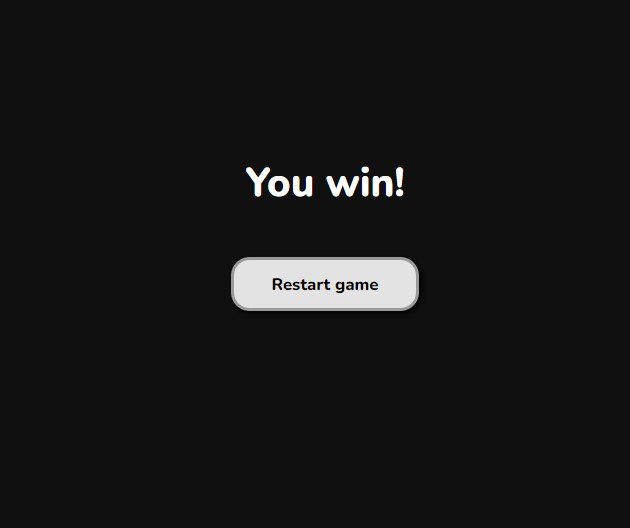

# Mini juego de memorama con ReactJS v1.0.1
## Descripción del proyecto

Este proyecto radica en un mini juego de memorama creado en ReactJS, en donde
tienes que encontrar las cartas iguales. Este va contando
los movimientos que haces y el tiempo que te has tardado. Cuenta
con 3 dificultades, facil, medio y dificil, en donde en cada nivel
aumenta la cantidad de cartas a adivinar.

## Imagenes

Vista de inicio de el juego de memorama, se pueden elegir 3 dificultades.

Vista de juego, al seleccionar cartas iguales estas se bloquean y pasamos a elegir
las demas.

Al completar las cartas se mostrará que haz ganado el juego.

